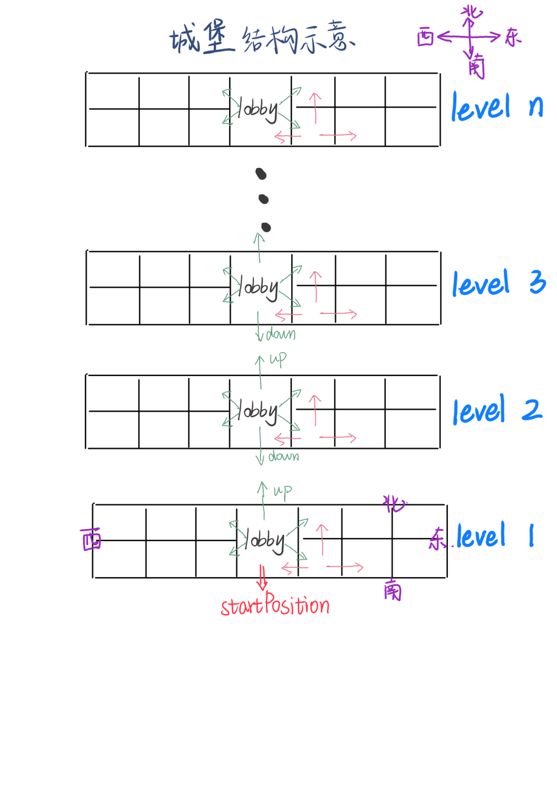

# CLI GAME - Adventure

## Background

你是一个Hero，任务是进入一个城堡寻找公主，公主被藏在城堡的某一个房间内，你需要一个个打开房间，然后找到公主，并把她带出城堡。但是要注意的是，房间可能会有怪兽，如果途中不幸遇到了怪兽，那你的探险之旅宣告失败。

为提高游戏的可玩性，房间会有特殊的属性，比如传送、信息提示等。

## Castle structure

城堡的结构示意图如下，有点类似于ZJU的学生寝室楼构造。这里放的图，对于一个单层而言，是俯视图，不同层之间可以通过lobbyRoom的up和down指令进行移动。



### 1. Location Type

#### Lobby Room

初始位置在第一层的lobbyRoom，可以选择up以及Southeast，Southwest，Northeast，Northwest这五个方向，如果不在最底层，则可以多一个Down选项。

#### Inner Room

每一层的其它房间，可选的三个移动方向为East West和Opposite

#### Westest Room / Eastest Room

只有两个方向，因为在楼层的边缘

### 2. Function Type

#### Lobby Room

楼梯间，作用是上下楼或者进入四个方向的其它房间，为方便继承，也作为抽象的“room”处理

#### Message Room

信息间，分两种类型，如果是Monster，那么告诉你Monster的楼层信息，如果是Princess，告诉你Princess的楼层信息

#### Transmittable Room

传送间，可以和另一个房间之间进行传送

#### Monster Room

怪兽间，放着怪兽，一旦遇到则输掉游戏

#### Princess Room

公主间，提示你带他回到一楼的楼梯间（起始位置），获得游戏胜利

#### Normal Room

一种普通的不能再普通的房间，没有特殊功能

## Enjoy playing

编译运行位于src目录下的整个工程，即可开始体验！

或者可以直接运行bin目录下的exe文件

### Guide

初始位置在第一层的lobbyRoom，可以选择up以及southeast，southwest，northeast，northwest这五个方向，如果在第二层及以上的lobbyRoom，则可以多一个down选项（总共有有六个方向）。对于每一层的其它房间，可选的三个移动方向为east、west和opposite。

游戏过程中CLI中会提示，在当前位置我们的下一步拥有怎样的选择，例如

```
There are 3 exits: east, west and opposite.
```

我们可以用这样的指令进行移动

```
go east
```


当然我们还有其它选择，比如 go west、 go up、go southeast等

若移动成功则无提示，如果输入的指令不合法（比如输入单词错误、或者输入的方向不在给定的选择中），提示错误（INSTRUCTION ERROR ！！！），并且重新输出该房间的信息和可选的方向。


